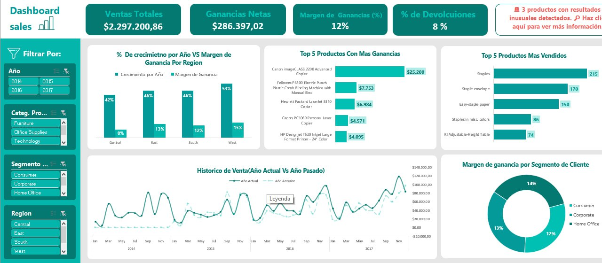
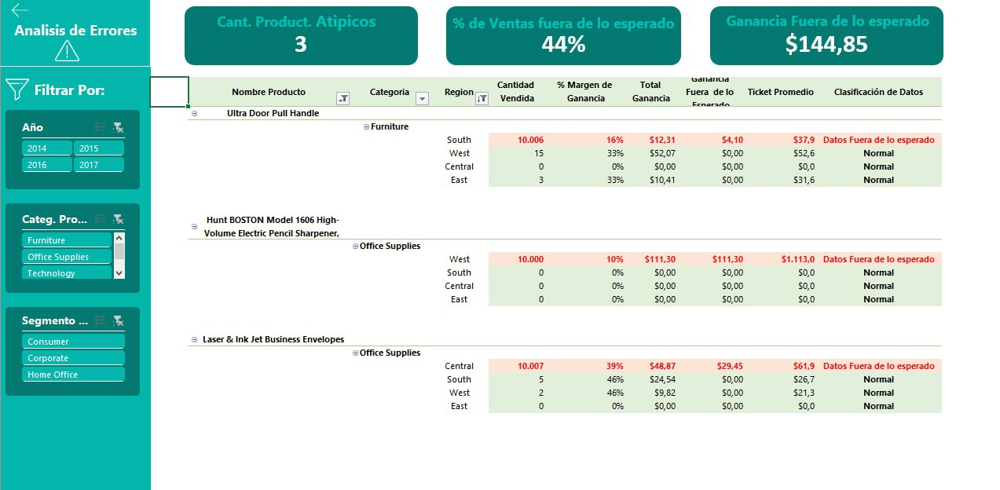

# 🛒 SuperStore Sales Dashboard

> **Análisis de ventas retail 2014–2017 con detección estadística de anomalías**  
> Herramientas: Excel · Power Query · Power Pivot · DAX

**Autor:** Joseph Velasco — Data Analyst  

---

## 🏷️ Tecnologías


---

## 📊 Vista del Dashboard

### Dashboard Principal — Sales Overview


### Análisis de Anomalías


---

## 📌 Descripción del Proyecto

Este proyecto analiza **4 años de datos de ventas** de una tienda retail americana (Superstore, dataset público de Kaggle) utilizando exclusivamente el ecosistema de Business Intelligence de Microsoft Excel.

El proyecto demuestra la capacidad de construir una solución BI completa —desde la limpieza de datos hasta el dashboard final— sin necesidad de herramientas externas, aplicando buenas prácticas de modelado dimensional y lógica estadística avanzada con DAX.

### ¿Qué hace especial a este proyecto?

La funcionalidad diferenciadora es la **detección automática de productos atípicos mediante Z-Score**, implementada completamente en DAX. El dashboard identifica en tiempo real qué productos tienen un comportamiento de venta estadísticamente anormal y los clasifica con una etiqueta visible, permitiendo al negocio tomar decisiones basadas en evidencia.

---

## 📈 KPIs Principales

| Métrica | Valor |
|---|---|
| 💰 Ventas Totales | $2,297,200.86 |
| 📈 Ganancias Netas | $286,397.02 |
| 📊 Margen de Ganancia | 12% |
| 🔄 % Devoluciones | 8% |
| ⚠️ Productos Atípicos Detectados | 3 |
| 🚨 % Ventas Fuera de lo Esperado | 44% |

---

## 🔍 Hallazgos e Insights del Negocio

### 1. Crecimiento desigual por región
La región **West** lidera con un 53% de crecimiento anual, casi duplicando a las regiones Central (42%) y East (46%). Sin embargo, su margen de ganancia (15%) es apenas superior al promedio, lo que sugiere que el crecimiento en volumen no se está traduciendo proporcionalmente en rentabilidad.

### 2. El segmento Consumer domina pero no lidera en margen
Consumer representa el mayor volumen de ventas, pero su margen (14%) es solo 2 puntos porcentuales superior al de Home Office (12%). Corporate, siendo el segmento de mayor ticket promedio, comparte un margen de 13%, lo que abre una oportunidad de optimización de precios en ese segmento.

### 3. Top productos por ganancia vs. por volumen no coinciden
Los productos con mayor ganancia (Canon imageCLASS 2200 — $25,200) no son los mismos que los más vendidos en unidades (Staples — 215 unidades). Esto indica una estrategia de portafolio mixta: productos de alto valor unitario conviven con productos de volumen masivo y bajo margen.

### 4. Anomalías detectadas en Furniture y Office Supplies
Los 3 productos flaggeados como atípicos pertenecen a las categorías Furniture y Office Supplies. El caso más notable es el **Hunt BOSTON Model 1606 Electric Pencil Sharpener** (West) con una ganancia fuera de lo esperado de **$111.30**, representando el 44% de las ventas clasificadas como anómalas en esa región.

### 5. Estacionalidad consistente
El histórico de ventas 2014–2017 muestra un patrón estacional repetible con picos en **Q4 (octubre–diciembre)**, lo que permite anticipar y planificar inventario y recursos de manera proactiva.

---

## 🏗️ Arquitectura del Proyecto

```
Dataset CSV (Kaggle)
        │
        ▼
┌─────────────────────┐
│   POWER QUERY (ETL) │  ← 5 consultas, limpieza y transformación
│  FactSale           │
│  Dim_Customer       │
│  Dim_Product        │
│  Dim_Location       │
│  Tabla_Calendario   │
└────────┬────────────┘
         │
         ▼
┌─────────────────────┐
│  POWER PIVOT        │  ← Modelo estrella + 30 medidas DAX
│  Esquema Estrella   │
│  Relaciones 1:N     │
└────────┬────────────┘
         │
         ▼
┌─────────────────────┐
│  DASHBOARDS         │  ← Tablas Dinámicas + Gráficos + Slicers
│  Sales Overview     │
│  Análisis Anomalías │
└─────────────────────┘
```

---

## 🗂️ Estructura del Repositorio

```
📁 Proyecto1-SuperStore/
│
├── 📊 Dashboard_Superstore.xlsx       ← Archivo principal con dashboards
├── 📄 dataset_Superstore.csv          ← Dataset fuente (Kaggle)
├── 📝 README.md                       ← Este archivo
├── 📋 SuperStore_Documentacion.pdf  ← Documentación técnica completa
│
└── 📁 screenshots/
    ├── Dashboard.jpg
    └── Errores.jpg
```

---

## ⚙️ Configuración — Cómo usar este archivo

> ⚠️ **Antes de abrir el Excel**, sigue estos pasos para que Power Query encuentre el archivo CSV en tu computadora.

### Paso 1 — Descarga y organiza los archivos

Descarga **ambos archivos** y colócalos en la misma carpeta:

```
📁 C:\TuCarpeta\SuperStore\
   ├── Dashboard_Superstore.xlsx
   └── dataset_Superstore.csv
```

### Paso 2 — Abre el Editor de Power Query

1. Abre `Dashboard_Superstore.xlsx` en Excel
2. Ve a **Datos → Obtener datos → Iniciar editor de Power Query**

### Paso 3 — Actualiza la ruta en las 4 consultas

Debes actualizar la ruta en estas consultas (no en Tabla_Calendario, que no lee archivos externos):

- `FactSale`
- `Dim_Customer`
- `Dim_Product`
- `Dim_Location`

Para cada una:
1. Haz clic en la consulta en el panel izquierdo
2. En **Pasos aplicados**, haz clic en **Origen**
3. En la barra de fórmulas verás la ruta original:
```
"E:\Portafolio\Proyecto 1-SuperStore\dataset_Superstore.csv"
```
4. Cámbiala por tu ruta local. Ejemplo:
```
"C:\TuCarpeta\SuperStore\dataset_Superstore.csv"
```

### Paso 4 — Aplica y cierra

Haz clic en **Inicio → Cerrar y cargar**. Los dashboards se actualizarán automáticamente.

> ❓ **¿Error "No se puede encontrar el archivo"?** Verifica que el `superstore.csv` esté en la misma carpeta que el `.xlsx` y que la ruta no tenga tildes o caracteres especiales.

---

## 📁 Documentación Técnica

Para una descripción detallada del modelado, medidas DAX, proceso ETL y decisiones de diseño, consulta el documento:

📋 **[SuperStore_Documentacion](./SuperStore_Documentacion.pdf)**

El documento incluye:
- Arquitectura completa del proyecto
- Pasos de transformación en Power Query
- Diagrama del modelo estrella y relaciones
- Las 30 medidas DAX con su fórmula y propósito
- Descripción de cada visualización en los dashboards

---

## 📦 Dataset

- **Fuente:** [Superstore Sales Dataset — Kaggle](https://www.kaggle.com/datasets/bhanupratapbiswas/superstore-sales)
- **Período:** 2014 – 2017
- **Registros:** 9,994 transacciones
- **Columnas originales:** Order ID, Order Date, Ship Date, Customer, Product, Sales, Quantity, Discount, Profit, entre otras.

---

## 📬 Contacto

**Joseph Velasco** — *Data Analyst | SQL Server · Power BI · Business Intelligence*

- 🔗 **LinkedIn:** [linkedin.com/in/Joseph_Velasco](https://linkedin.com/in/joseph-velasco)
- 💼 **Portfolio:** [Tu enlace aquí]
- 🐙 **GitHub:** [github.com/Joseph_Velasco](https://github.com/DatajosephVe)

---
